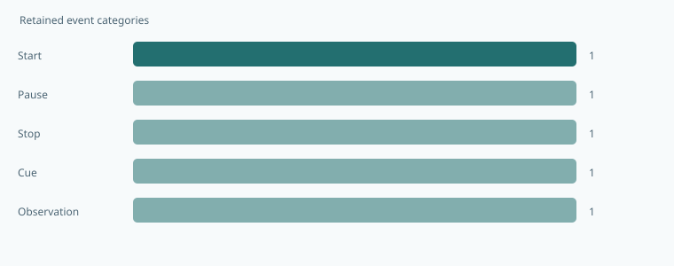
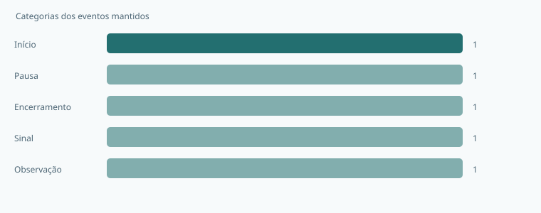

# Évia Local Event Journal

**Keep useful research events without collecting personal narratives.**  
**Registre eventos úteis de pesquisa sem coletar relatos pessoais.**

[](https://github.com/galafis/evia-local-event-journal/actions/workflows/ci.yml) · **v0.1.0** · **28 automated tests / testes automatizados** · **MIT**

[English](#english) · [Português](#portugues) · [Live workbench · Demonstração](https://galafis.github.io/evia-local-event-journal/) · [Examples · Exemplos](#examples)

<a id="english"></a>

## English

A local event-journal builder for minimal, coded research records. It validates a small vocabulary, applies an explicit export retention window and builds an inspectable integrity chain.

This is independently implemented public companion work for Évia. It has no dependency on the Évia core and uses synthetic fixtures.

### What works today

- Strict event fields with no free-text notes, attachments, participant names or media fields.
- Opaque session codes, unique event codes and a bounded outcome vocabulary.
- Deterministic timestamp ordering and inclusive retention boundaries.
- SHA-256 record chaining, final-root export and a reusable verification function.
- Tests that demonstrate both detectable corruption and the limits of an unkeyed chain.



### Run it locally

Use **Node.js 22 or newer**. There are no third-party runtime packages to install.

```sh
git clone https://github.com/galafis/evia-local-event-journal.git
cd evia-local-event-journal
npm test
npm start
```

Open **http://127.0.0.1:4173**. The browser includes an English/Portuguese switch. Choose an example, adjust the primary assumption, and select **Update**. Expand **Edit all scenario fields** for the complete JSON editor. Invalid imports leave the last valid result visible with an explicit error message. Export both the scenario and report to preserve the experiment.

For headless use:

```sh
node scripts/analyze.mjs examples/nominal.json report.json
npm run examples
npm run test:coverage
```

The command-line exit codes are **0** for completed analysis or review notes, **2** for a valid scenario that needs review, and **1** for invalid input or invocation. A review-required result is still written to the requested report file.

### An experiment you can reproduce

The nominal input contains five coded events ending at 10,000 ms. A 3,000 ms retention window keeps the events at 7,000, 9,000 and 10,000 ms. Editing one retained outcome breaks verification against the exported root; recomputing a chain does not establish authenticity.

### How the result is calculated

- Accepted event kinds are session-start, session-pause, session-stop, cue-presented and observation. Outcomes are ok, skipped, interrupted or unknown.
- Event codes follow e-0001 style. Session codes follow s-00000001 style and must not be reused as a public person identifier.
- Validate all input events before retention filtering. Unknown fields, duplicate event codes and events after nowMs are rejected.

```text
hash[i] = SHA-256(canonical(sequence, event fields, hash[i−1])) / hash[i] = SHA-256(ordem canônica da sequência, campos do evento e hash[i−1])
```

The [architecture guide](docs/ARCHITECTURE.md) explains every rule and boundary case. The [data contract](docs/DATA_CONTRACT.md) documents fields, units, limits and the report envelope. [Research scope](docs/RESEARCH_SCOPE.md) separates implemented behavior from future platform work.

### What the result does not establish

This is not encryption, anonymization, a digital signature or a compliance certification. Opaque codes and timing can remain linkable. Retention filters the generated export and does not erase original files, browser text areas or earlier downloads. The browser stores only the language preference automatically.

### Where this fits

Use synthetic events to design a minimal observation vocabulary alongside the public session prototypes. Before any real research record is collected, establish a separate protocol for consent, access, retention and deletion. Review provenance and expected roots outside the editable journal itself.

Related public project: [evia-session-orchestrator](https://github.com/galafis/evia-session-orchestrator). Each repository is independently runnable; a link does not imply a live integration. See [integration notes](docs/INTEGRATION.md) for the exact supported exchange, where present.

[Back to language navigation](#english)

---

<a id="portugues"></a>

## Português

Um construtor local de registros mínimos e codificados de eventos de pesquisa. Valida um vocabulário reduzido, aplica uma janela explícita de retenção da exportação e constrói uma cadeia inspecionável de integridade.

Este é um trabalho público complementar à Évia, implementado de forma independente. Não depende do núcleo da Évia e utiliza exemplos sintéticos.

### O que já funciona

- Campos estritos de eventos, sem notas livres, anexos, nomes de participantes ou campos de mídia.
- Códigos opacos de sessão, códigos únicos de eventos e vocabulário delimitado de resultados.
- Ordenação determinística por instante e limites inclusivos de retenção.
- Encadeamento de registros com SHA-256, exportação da referência final e função reutilizável de verificação.
- Testes que demonstram tanto alterações detectáveis quanto os limites de uma cadeia sem chave.



### Executar localmente

Use **Node.js 22 ou mais recente**. Não há pacotes externos de execução para instalar.

```sh
git clone https://github.com/galafis/evia-local-event-journal.git
cd evia-local-event-journal
npm test
npm start
```

Abra **http://127.0.0.1:4173**. O navegador oferece alternância entre português e inglês. Escolha um exemplo, ajuste a hipótese principal e selecione **Atualizar**. Expanda **Editar todos os campos do cenário** para acessar o editor JSON completo. Importações inválidas mantêm o último resultado válido visível com mensagem explícita de erro. Exporte o cenário e o relatório para preservar o experimento.

Para usar sem interface gráfica:

```sh
node scripts/analyze.mjs examples/nominal.json report.json
npm run examples
npm run test:coverage
```

Os códigos de saída são **0** para análise concluída ou com notas, **2** para cenário válido que exige revisão e **1** para entrada ou chamada inválida. Resultados que exigem revisão também são gravados no arquivo de relatório solicitado.

### Um experimento reproduzível

A entrada nominal contém cinco eventos codificados, terminando em 10.000 ms. Uma janela de retenção de 3.000 ms mantém os eventos em 7.000, 9.000 e 10.000 ms. Editar um resultado mantido invalida a verificação contra a referência exportada; recalcular uma cadeia não comprova autenticidade.

### Como o resultado é calculado

- Os tipos aceitos são session-start, session-pause, session-stop, cue-presented e observation. Os resultados são ok, skipped, interrupted ou unknown.
- Os códigos de evento seguem o formato e-0001. Os códigos de sessão seguem s-00000001 e não devem ser reutilizados como identificador público de uma pessoa.
- Valide todos os eventos antes de filtrar por retenção. Campos desconhecidos, códigos duplicados e eventos posteriores a nowMs são rejeitados.

```text
hash[i] = SHA-256(canonical(sequence, event fields, hash[i−1])) / hash[i] = SHA-256(ordem canônica da sequência, campos do evento e hash[i−1])
```

O [guia de arquitetura](docs/ARCHITECTURE.md) explica todas as regras e os casos limite. O [contrato de dados](docs/DATA_CONTRACT.md) documenta campos, unidades, limites e o formato do relatório. O [escopo de pesquisa](docs/RESEARCH_SCOPE.md) separa funcionalidades implementadas de futuras etapas com a plataforma.

### O que o resultado não comprova

Isto não é criptografia de conteúdo, anonimização, assinatura digital ou certificação de conformidade. Códigos opacos e horários podem continuar associáveis. A retenção filtra a exportação gerada e não apaga arquivos originais, campos de texto do navegador ou downloads anteriores. O navegador armazena automaticamente apenas a preferência de idioma.

### Como este projeto se conecta ao portfólio

Use eventos sintéticos para definir um vocabulário mínimo de observação junto aos protótipos públicos de sessão. Antes de coletar registros reais de pesquisa, estabeleça um protocolo separado para consentimento, acesso, retenção e exclusão. Revise a origem dos dados e as referências esperadas fora do próprio registro editável.

Projeto público relacionado: [evia-session-orchestrator](https://github.com/galafis/evia-session-orchestrator). Cada repositório funciona independentemente; um link não implica integração em tempo real. Consulte as [notas de integração](docs/INTEGRATION.md) para conhecer as trocas efetivamente suportadas, quando existentes.

---

<a id="examples"></a>

## Reproducible examples · Exemplos reproduzíveis

| Example · Exemplo                         | Result · Resultado | Reproduce · Reproduzir                                                                                          |
| ----------------------------------------- | ------------------ | --------------------------------------------------------------------------------------------------------------- |
| Local session<br>Sessão local             | `complete`         | [Input · Entrada](examples/nominal.json) · [Report · Relatório](examples/nominal.report.json)                   |
| Retention window<br>Janela de retenção    | `review-notes`     | [Input · Entrada](examples/retention-window.json) · [Report · Relatório](examples/retention-window.report.json) |
| Reordered events<br>Eventos fora de ordem | `complete`         | [Input · Entrada](examples/reordered-events.json) · [Report · Relatório](examples/reordered-events.report.json) |

## Project guide · Guia do projeto

| Document · Documento                                          | Content · Conteúdo                                                                    |
| ------------------------------------------------------------- | ------------------------------------------------------------------------------------- |
| [Architecture · Arquitetura](docs/ARCHITECTURE.md)            | Domain rules, algorithms and boundaries · Regras, algoritmos e limites                |
| [Data contract · Contrato de dados](docs/DATA_CONTRACT.md)    | Fields, units and JSON format · Campos, unidades e formato JSON                       |
| [Schema](schemas/scenario.schema.json)                        | Structural JSON Schema · Esquema estrutural JSON                                      |
| [Validation · Validação](docs/VALIDATION.md)                  | Behavioral tests and review protocol · Testes de comportamento e protocolo de revisão |
| [Research scope · Escopo de pesquisa](docs/RESEARCH_SCOPE.md) | Platform relationship and next steps · Relação com a plataforma e próximas etapas     |
| [Integration · Integração](docs/INTEGRATION.md)               | Public artifact exchange · Troca de artefatos públicos                                |
| [Contributing · Contribuições](CONTRIBUTING.md)               | Development and review · Desenvolvimento e revisão                                    |
| [Security · Segurança](SECURITY.md)                           | Privacy and responsible reports · Privacidade e relatos responsáveis                  |
| [Changelog · Histórico](CHANGELOG.md)                         | Versioned changes · Alterações por versão                                             |

## Maintainer · Responsável

**Gabriel Demetrios Lafis** · Brazil / Brasil  
**[gabrieldemetrioslafis@usp.br](mailto:gabrieldemetrioslafis@usp.br)** · [GitHub](https://github.com/galafis)

Independent work; institutional contact does not imply institutional or vendor endorsement.  
Trabalho independente; o contato institucional não implica endosso de instituição ou fabricante.
