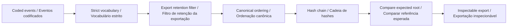

# Architecture · Arquitetura

[README](../README.md) · [Data contract · Contrato de dados](DATA_CONTRACT.md)

## English

The domain engine in `src/engine.js` is independent of the document, network and local storage. The same `run(input)` function powers the browser and command-line interface. Awaiting it works for every project, including the asynchronous journal hashing operation.

```text
scenario JSON → strict validation → deterministic domain engine → report
                                                           ↘ bilingual view
```

- Accepted event kinds are session-start, session-pause, session-stop, cue-presented and observation. Outcomes are ok, skipped, interrupted or unknown.
- Event codes follow e-0001 style. Session codes follow s-00000001 style and must not be reused as a public person identifier.
- Validate all input events before retention filtering. Unknown fields, duplicate event codes and events after nowMs are rejected.
- Retain events at or after max(0, nowMs − retentionMs). A zero window retains only events at nowMs.
- Sort by time and then event code. Canonical field ordering makes equivalent input orderings produce the same chain.
- Each hash includes the previous hash and a sequence number. Keep the expected final root separately to detect removal of trailing records. A party able to recompute all hashes can construct a different internally valid chain.

### Model

```text
hash[i] = SHA-256(canonical(sequence, event fields, hash[i−1])) / hash[i] = SHA-256(ordem canônica da sequência, campos do evento e hash[i−1])
```

Inputs are checked before computation and are not mutated. Unknown keys are rejected at the validated scenario and nested-domain boundaries. Reports contain no wall-clock creation timestamp, so the same input produces identical JSON under the same analysis version. UI formatting changes decimal separators without changing exported numeric values.

The browser parses imports locally, limits them to 1 MB, renders supplied text through escaping, and discards stale asynchronous results using a revision counter. It retains only the language preference automatically. Charts are previews; complete records remain in exports. The local development server binds to `127.0.0.1` and rejects hidden or out-of-root paths.

## Português

O mecanismo de domínio em `src/engine.js` é independente do documento, da rede e do armazenamento local. A mesma função `run(input)` atende ao navegador e à interface de linha de comando. Ela pode ser aguardada com `await` em todos os projetos, inclusive no cálculo assíncrono dos hashes do registro.

```text
cenário JSON → validação estrita → mecanismo determinístico → relatório
                                                       ↘ visualização bilíngue
```

- Os tipos aceitos são session-start, session-pause, session-stop, cue-presented e observation. Os resultados são ok, skipped, interrupted ou unknown.
- Os códigos de evento seguem o formato e-0001. Os códigos de sessão seguem s-00000001 e não devem ser reutilizados como identificador público de uma pessoa.
- Valide todos os eventos antes de filtrar por retenção. Campos desconhecidos, códigos duplicados e eventos posteriores a nowMs são rejeitados.
- Mantenha eventos a partir de máximo(0, nowMs − retentionMs), inclusive. Uma janela zero mantém apenas eventos em nowMs.
- Ordene por instante e depois por código de evento. A ordem canônica dos campos faz entradas equivalentes produzirem a mesma cadeia.
- Cada hash inclui o hash anterior e um número de sequência. Mantenha a referência final esperada separadamente para detectar remoção de registros finais. Quem recalcula todos os hashes pode criar outra cadeia internamente válida.

As entradas são verificadas antes do cálculo e não são alteradas. Chaves desconhecidas são rejeitadas no cenário e nas estruturas de domínio validadas. Os relatórios não incluem horário real de criação; assim, a mesma entrada produz JSON idêntico sob a mesma versão da análise. A formatação visual altera separadores decimais sem alterar os valores numéricos exportados.

O navegador lê as importações localmente, limita-as a 1 MB, escapa textos informados antes da exibição e descarta resultados assíncronos antigos com um contador de revisão. Apenas a preferência de idioma é armazenada automaticamente. Os gráficos são prévias; os registros completos permanecem na exportação. O servidor local atende em `127.0.0.1` e rejeita caminhos ocultos ou externos à pasta.

## Files · Arquivos

| Path · Caminho        | Responsibility · Responsabilidade                                                       |
| --------------------- | --------------------------------------------------------------------------------------- |
| `src/engine.js`       | Domain behavior · Comportamento de domínio                                              |
| `src/validation.js`   | Strict primitives and report contract · Validação e contrato do relatório               |
| `src/view.js`         | Project-specific chart and interpretation · Gráfico e interpretação próprios do projeto |
| `src/app.js`          | Browser workflow, imports and language · Fluxo do navegador, importações e idioma       |
| `src/ui.js`           | Escaping, formatting and downloads · Escape de texto, formatação e downloads            |
| `scripts/analyze.mjs` | Command-line adapter · Adaptador de linha de comando                                    |
| `tests/`              | Behavioral and contract checks · Verificações de comportamento e contrato               |
| `examples/`           | Synthetic inputs and expected reports · Entradas sintéticas e relatórios esperados      |

## Domain decision flow · Fluxo de decisões do domínio


