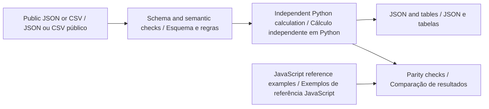

# Python offline guide · Guia Python offline

[English](#english) · [Português](#portugues) · [Project / Projeto](../README.md)

**Python companion v0.2.0 · Python 3.11+ · Python · SQL · JavaScript**



<a id="english"></a>

## English

Create retention-limited exports of the already public event schema, verify their digest chain in Python and inspect aggregate counts with SQL. This is a standalone public companion for evaluating minimal event records.

### Install and run

From the repository root, create a virtual environment with `python -m venv .venv`. Activate it with `.venv\Scripts\Activate.ps1` in PowerShell or `source .venv/bin/activate` in a Unix shell. Use `python3` instead of `python` if required by your installation.

```sh
python -m pip install -r requirements-python.txt .
python -m evia_journal --help
python -m evia_journal analyze examples/nominal.json review-output/nominal.report.json
python -m evia_journal store examples/nominal.json review-output/analysis.sqlite
python -m evia_journal query review-output/analysis.sqlite review-output/sql-review.json
python -m evia_journal verify review-output/analysis.sqlite local-session 6ac24de383eeb71d1abb085b432196b270747954d7418f36cdbf13b12d29f2e2 review-output/verification.json
```

The first analysis creates `review-output/`. Use a new SQLite filename for a new archive, when applicable. Reimporting the same scenario identifier is rejected to preserve the previous record. Runtime calculations require Python and the declared schema-validation dependencies; Node is needed only for the browser application and cross-language tests.

### Method and worked example

Reject unknown fields and future timestamps. Retain events at or after the cutoff, sort by time then event identifier, and hash a canonical UTF-8 JSON representation with SHA-256. SQLite persists only the retained public records and aggregate exclusion count. Verification requires a root retained independently of the mutable database.

```text
cutoffMs = max(0, nowMs - retentionMs)
retained = events where atMs >= cutoffMs
hash = SHA256(canonicalJSON(sequence, eventFields, previousHash))
```

The nominal five-event export is reproduced byte-for-byte at the hash level by Python and JavaScript. Changing the retention window to 1,000 ms keeps the events at 9,000 and 10,000 ms. Transaction tests deliberately fail the second insert and confirm that no partial export survives.

Browse the [committed inputs and outputs](../examples/python/README.md). CSV column order and names must match the example header exactly. Missing columns, extra columns, malformed numbers, duplicate identifiers and non-finite values are rejected where applicable. JSON rejects unknown fields and duplicate object keys. The public [scenario schema](../schemas/scenario.schema.json) defines units and field bounds; the domain module adds relationships that JSON Schema alone cannot express.

### Use as a library

```python
from pathlib import Path
from evia_journal import analyze
from evia_journal.contract import read_json

scenario = read_json(Path("examples/nominal.json"))
result = analyze(scenario)
print(result["scenarioId"])
```

See the [calculation module](../python/evia_journal/core.py) and [CLI](../python/evia_journal/__main__.py). The Python result is a documented offline summary, not the complete bilingual browser report envelope. Shared numerical fields and paths are independently compared; matching output is a software consistency check, not physical validation.

### Verify

Install Node.js 22+ for the independent JavaScript comparisons, then run:

```sh
python -m unittest discover -s python/tests -v
python scripts/check-python-examples.py
npm test
```

The Python suite covers the strict public contract, unchanged inputs, invalid-file handling, preservation of previous outputs, domain boundaries and every canonical example listed in `examples/index.json`. The example checker executes the documented workflows in a temporary directory and compares JSON/CSV artifacts. Use its `--write` option only after intentionally reviewing a changed result. CLI exit status is 0 for a completed calculation and 1 for invalid input or a failed integrity check. Inspect result flags for review conditions; this differs from the browser CLI's status-2 convention.

### Interpretation boundary

An unkeyed hash chain is not authentication: someone can rewrite an entire chain and its locally stored root. Retention filters a new export; it does not erase older exports or the source file. Opaque session codes are not proof of anonymization. No private Évia implementation, internal interface or operational data is included.

### SQL archive

The [schema](../python/evia_journal/sql/schema.sql), [review query](../python/evia_journal/sql/review.sql) and [transactional importer](../python/evia_journal/storage.py) are executable parts of the package. Parameterized inserts avoid interpreting input as SQL. Foreign keys are enabled by `connect()`. Each import is atomic; duplicate scenario identifiers fail without replacement. Query results retain explicit denominators. The database remains a local analysis artifact and is excluded from version control.

<a id="portugues"></a>

## Português

Crie exportações com retenção limitada do esquema de eventos já público, verifique sua cadeia de resumos em Python e inspecione contagens agregadas com SQL. Este é um complemento público independente para avaliar registros mínimos de eventos.

### Instalação e execução

Na raiz do repositório, crie o ambiente com `python -m venv .venv`. Ative com `.venv\Scripts\Activate.ps1` no PowerShell ou `source .venv/bin/activate` em um shell Unix. Use `python3` se essa for a nomenclatura da instalação. Execute a sequência de comandos da seção inglesa: ela é a mesma nos dois idiomas. A primeira análise cria `review-output/`.

Instale com `python -m pip install -r requirements-python.txt .`. Os cálculos dependem de Python e das dependências declaradas para validação de esquema. Node.js 22+ é necessário somente para o aplicativo de navegador e para os testes entre linguagens. Quando houver SQLite, use um arquivo novo para um novo arquivo de análise; identificadores de cenário repetidos são rejeitados, preservando os registros existentes.

### Método e exemplo explicado

Rejeite campos desconhecidos e instantes futuros. Mantenha eventos no limite de retenção ou depois dele, ordene por instante e identificador e calcule SHA-256 de um JSON UTF-8 canônico. SQLite persiste apenas registros públicos retidos e contagem agregada de exclusão. A verificação exige uma raiz guardada independentemente do banco mutável.

A exportação nominal de cinco eventos é reproduzida por Python e JavaScript com hashes idênticos. Uma janela de retenção de 1.000 ms mantém os eventos de 9.000 e 10.000 ms. Testes transacionais falham deliberadamente na segunda inserção e confirmam que nenhuma exportação parcial permanece.

As fórmulas e os comandos acima usam nomes de campos estáveis, compartilhados pelos dois idiomas. Consulte as [entradas e saídas versionadas](../examples/python/README.md). Cabeçalhos CSV devem corresponder exatamente ao exemplo, incluindo a ordem. Colunas ausentes ou extras, números malformados, identificadores duplicados e valores não finitos são rejeitados quando aplicável. JSON rejeita campos desconhecidos e chaves repetidas. O [esquema público](../schemas/scenario.schema.json) define unidades e limites; o módulo de domínio valida relações adicionais.

### Biblioteca e validação

O exemplo Python da seção inglesa funciona diretamente. O [módulo de cálculo](../python/evia_journal/core.py) retorna um resumo offline documentado; ele não replica todo o envelope bilíngue do relatório de navegador. Os campos numéricos e caminhos compartilhados são comparados independentemente. Concordância é uma verificação de consistência do software, não validação física.

Execute `python -m unittest discover -s python/tests -v`, `python scripts/check-python-examples.py` e `npm test`. A suíte Python cobre o contrato, preservação de entradas, arquivos inválidos, manutenção da saída anterior, limites do domínio e todos os exemplos canônicos do índice. O verificador executa os fluxos em diretório temporário e compara os artefatos JSON/CSV. Use `--write` somente após revisar uma mudança intencional. O código de saída é 0 para cálculo concluído e 1 para entrada inválida ou falha de integridade. Consulte as sinalizações do resultado; a convenção difere do código 2 da interface de análise em JavaScript.

### Limites de interpretação

Uma cadeia de hashes sem chave não é autenticação: alguém pode reescrever toda a cadeia e sua raiz local. A retenção filtra uma nova exportação; não apaga exportações anteriores nem o arquivo fonte. Códigos opacos de sessão não comprovam anonimização. Nenhuma implementação privada da Évia, interface interna ou dado operacional está incluído.

### Arquivo SQL

O [esquema](../python/evia_journal/sql/schema.sql), a [consulta de revisão](../python/evia_journal/sql/review.sql) e o [importador transacional](../python/evia_journal/storage.py) são executáveis. Inserções parametrizadas evitam interpretar entradas como SQL. `connect()` habilita chaves estrangeiras. Cada importação é atômica; identificadores repetidos falham sem substituir dados. Denominadores ficam explícitos nas consultas. O banco é um artefato local de análise, excluído do controle de versão.
